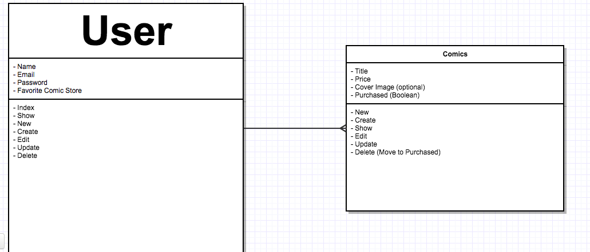

# ComicColl

---

A place for comic nerds to store their library.

Visit the app [ComicColl](https://secret-chamber-72331.herokuapp.com/)

Take a look at my [Trello](https://trello.com/b/F6ydCQPL/project-2)

## How It Works

Sign Up to create and account. Once your account is created you can add comics to your library by visiting your page. If you have the cover image of the comic, feel free to add a URL linking to it.

Each comic can be edited after it has been added to your library. If you ever decide you're too old for comics, you can delete your account and continue your mundane comic free life.

## Technologies Used

- HTML
- CSS
- Ruby
- Rails
- Bootstrap

## Entity Relations

## User Stories

As a user, I want to be able to create an account to save my wishlist.

As a visitor, I want to be able to view a person's wishlist without signing up for an account.

As a visitor, I want to be able to view details about a comic on a users wishlist.

As a user, I want to upload a pic of the cover art for a comic in my library.

As a user, I want people to know that I already own a comic.

As a developer, I want my code DRY.

## MVP

- Git repo hosted on Github
- Two models: Users and Comics
- Sign Up/Log In functionality
- Complete RESTful routes
- DRY Code
- Deployed to Heroku

## Known Issues

- No default image for comic covers
- Purchased checkbox will not update value

## Goals

- Search function to find a users page
- Display where comics can be purchased
- Add a purchased section to the library, when comic is updated move it to the correct section

## Acknowledgements

The background image from the index is from [Pixabay](http://pixabay.com).